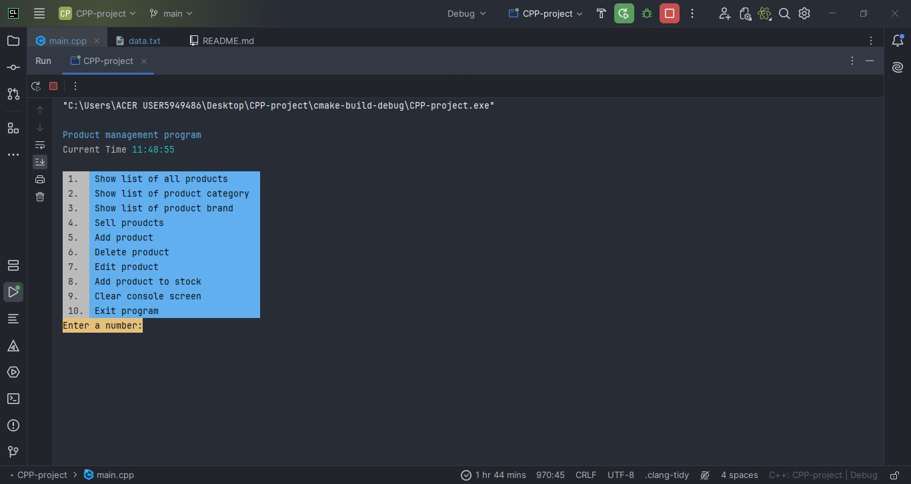

<div align="center">
   
</div>

<h1 align="center">มหาวิทยาลัยเกษตรศาสตร์วิทยาเขตศรีราชา</h1>

> ส่งงาน project วิชา Computer Programming ปี 1 ภาคปลาย

<h1 align="center">โปรแกรมระบบจัดการสินค้า</h1>

โดยโปรเจคนี้มีทั้งหมด 2 branches ได้แก่
1. <code>main</code> เป็น branch ที่มีการใช้ libraries ซึ่งค่อนข้างยุ่งยากถ้าหากไม่สามารถใช้งาน branch นี้ได้ให้ใช้อีก branch นึงคือ
2. <code>main2</code> เป็น branch ที่ไม่มีการใช้งาน libraries ใดๆสามารถ run โปรแกรมและใช้งานได้เลยโดยกดที่ลิ้งนี้ <a href="https://github.com/WarinCode/CPP-project/tree/main2">main2</a>

รายละเอียดโปรเจค : โปรเจคนี้ทำเกี่ยวกับ โปรเแกรมระบบจัดการสินค้าใน ร้านสินค้า , ร้านขายของ , ร้านสดวกซื้อ โดยการใช้งานเมื่อรันโปรแกรมผ่าน CLI ของโปรแกรมจะมีตัวเลือกคือตัวเลขให้ผู้ใช้งานป้อนตัวเลขใน
terminal ก็จะแสดงข้อมูล หรือ การจัดการกับสินค้าต่างๆ ตามฟีเจอร์ที่ได้ระบุไว้ และ เมื่อมีการจัดการกับข้อมูลสินค้าโปรแกรมจะมีการเขียนและอ่านไฟล์ข้อมูล <code>data.txt</code> ใหม่และเมื่อมีการ
ขายสินค้าจะมีการเขียนไฟล์ใน <code>orders.txt</code> และข้อมูลไฟล์ <code>data.txt</code> จะมีการเปลี่ยนแปลงไปตามจำนวนสินค้าที่ขายออกไป


เป็นโปรเจคแบบง่ายๆ โดยใช้ภาษา C++ ในการเขียนโปรแกรม

---

### เวลาที่ใช้ในการทำโปรเจค

[](https://wakatime.com/badge/user/68e3e2dc-451c-45ef-bca8-9fc3ad60e2f9/project/018dad0f-df31-4661-aeef-7cab5890fdeb)

วันที่เริ่มทำโปรแกรม : 13/2/2567

วันที่ทำโปรแกรมเสร็จ : 28/2/2567

### ฟีเจอร์ของโปรแกรม
- เพิ่มสินค้า
- ลบสินค้า
- แก้ไขสินค้า
- สั่งซื้อสินค้า
- เพิ่มสินค้าใน stock
- แสดงตารางสินค้า ทั้งหมด , หมวดหมู่สินค้า หรือ แบรนด์สินค้า ที่เลือก
- อ่านเขียนไฟล์ข้อมูลในไฟล์ <code>data.txt</code>
- เขียนไฟล์ข้อมูลสรุปการสั่งซื้อสินค้าในไฟล์ <code>orders.txt</code>
- บอกวันเวลา

### เครื่องมือที่ต้องมีก่อนใช้งาน
<span style= "display: flex;">
    <a href="https://git-scm.com/downloads" target="_blank">
         &nbsp;&nbsp;
    </a>
    <a href="https://learn.microsoft.com/en-us/powershell/scripting/install/installing-powershell-on-windows?view=powershell-7.4" target="_blank">
         &nbsp;&nbsp;
    </a>
    <a href="https://www.jetbrains.com/clion/download/#section=windows" target="_blank">
         &nbsp;&nbsp;
    </a>
    <a href="https://code.visualstudio.com/download" target="_blank">
         &nbsp;&nbsp;
    </a>
    <a href="https://visualstudio.microsoft.com/downloads/" target="_blank">
        
    </a>
</span>

- คลิกที่รูป icon ของแต่ละโปรแกรมเพื่อดาวโหลด์ได้เลย
- ถ้ามี cmd, powershell หรือ windows terminal อยู่แล้วไม่ต้องคลิก icon รูปที่ 2 ให้เลือกใช้สักอันนึงแทน
- IDE ให้เลือกใช้อย่างใดอย่างหนึ่งส่วนผู้เขียนใช้ IDE เป็น CLion

### ขั้นตอนการติดตั้งและใช้งานโปรแกรม

1. เปิด terminal แล้วใช้คำสั่งดาวน์โหลด์โปรเจค
```
git clone https://github.com/WarinCode/CPP-project.git
```

2. เข้าไปใน directory ของโปรเจค
```
cd CPP-project
```

3. โหลด source code ของ submodule จะได้ไฟล์ libraries
```
git submodule update --init --recursive
```

4. ถ้าทำตามขั้นตอนที่ว่ามาทั้งหมดก็ถือว่าเกือบพร้อมใช้งานได้แล้วแต่ที่สำคัญในส่วนของการอ่านและเขียนไฟล์ข้อมูลให้ทำการเขียนทับ path ในส่วนของ method read , write และ update ของ class File
<code>string path = R"(C:\Users\ACER USER5949486\Desktop\CPP-project\txts\data.txt)"</code> โดยให้เปลี่ยนเป็นชื่อผู้ใช้งานแทน <code>string path = R"(C:\Users\user\Desktop\CPP-project\txts\data.txt)"</code>
ให้เปลี่ยนจาก <code>user</code> เป็นเครื่องชื่อผู้ใช้งานแทน

``` c++
// ตัวอย่าางการเปลี่ยนค่าใน path file เป็น path file ในเครื่องของผู้ใช้งาน
#include <iostream>
using std::string;

typedef struct {
    string data;
    string orders;
} textFiles;
// ให้แทนค่าตรงคำว่า user เป็นเครื่องผู้ใช้งานแทน
const textFiles path = { 
    .data=R"(C:\Users\user\Desktop\CPP-project\txts\data.txt)", 
    .orders=R"(C:\Users\user\Desktop\CPP-project\txts\orders.txt)"
};

// ตัวอย่างแบบที่ 1 คือการเข้าไปแก้ไขค่าใน default parameter ใน method read และ write
class File {
public:

    static void read(string path = path.data, bool showMessage = false){
        // code ข้างในการทำงานของ method ไม่ต้องแก้ไขใดๆ ...
    }

    static void write(string path = path.data, bool showMessage = false){
        // ...
    }

    static void write(vector<product> orders, int totalNumbers, float totalAmount, string path = path.orders, bool showMessage = false){
        // ...
    }
    
    static void update(string path = path.data){
        // ... 
    }
};

// ตัวอย่างแบบที่ 2 คือการส่งค่า argument เข้าไปแทนใน default parameter เมื่อมีการเรียกใช้ method ในแต่ละบรรทัด
File::read(path.data);
File::write(path.data);
// ถ้าเป็น method แบบ overloading ให้ส่งค่า args ตัวอื่นไปก่อนตามลำดับ
File::write(orders, quantity, total, path.orders);
File::update(path.data);
```

5. เปิด CLion ขึ้นมาแล้วเลือก build โปรแกรม(icon เป็นรูปค้อน) จากนั้นเลือก Configurations ให้เลือกเป็น <code>CPP-project</code> และ run ไฟล์ main.cpp จะได้โปรแกรมหน้าตาประมาณนี้

<div align="center">
    
</div>

6. ถ้าหาก run ไฟล์ main.cpp ไม่ได้ หรือ ติดปัญหา compile ไม่ผ่านหรือติดตั้ง submodules ไม่ได้ให้ทำการเปลี่ยน branch เป็น branch main2 กลับไปที่ terminal โดยใช้คำสั่งนี้ (terminal ต้องอยู่ใน path ของโฟลเดอร์โปรเจค CPP-project อยู่)
```
git switch main2
```

7. ตอนนี้เรากำลังทำงานอยู่ใน branch main2 โดยจะเจอไฟล์ main.cpp ให้ compile ไฟล์นั้นจะได้ program.exe ขึ้นมา
```
g++ main.cpp -o program.exe
```

8. เปิดโปรแกรมที่ได้มาใน terminal
```
./program.exe
```

จะได้โปรแกรมหน้าตาประมาณนี้
<div align="center">

</div>

แล้วเหมือนเดิมให้ทำการแก้ไข path ไฟล์ โดยทำตามขั้นตอนที่ได้กล่าวไว้ในขั้นตอนที่ 4

ปล. สามารถนำโปรเจคนี้ไปใช้งานหรือพัฒนาต่อยอดได้ฟรี แต่ข้อห้ามคือห้าม copy code ไปส่งเป็นงานกลุ่มโปรเจคของตัวเองทั้งที่ไม่ได้ทำเอง หรือ นำโปรแกรมไปขาย

### รายชื่อสมาชิกในกลุ่ม
1. นาย วรินทร์ สายปัญญา รหัสนิสิต 6630250435 หมู่เรียน 881
